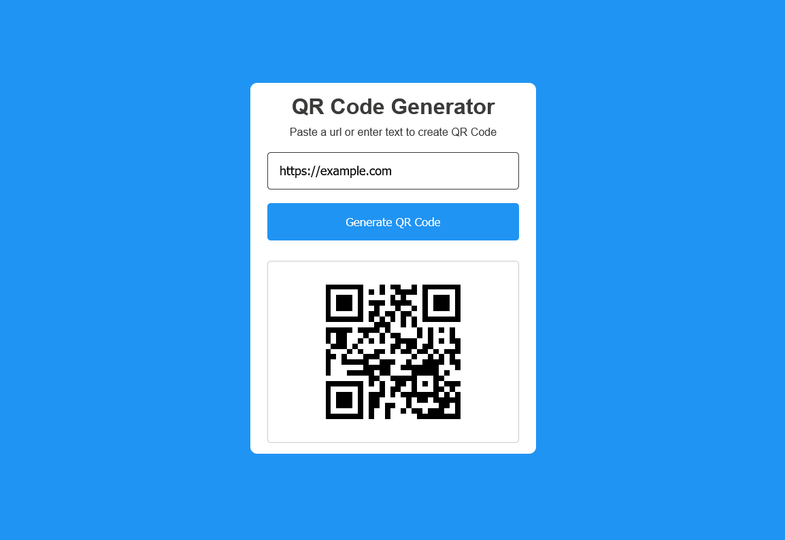

# QR Code Generator

A simple web application that generates QR codes from user input using the [goqr.me API](http://goqr.me/api/).
Built with **HTML**, **CSS**, and **JavaScript**.

---

## Features

* Generate QR codes instantly from text or URLs
* Responsive design with styled input and button
* Uses CSS custom properties for easy color theming

---

## Project Structure

```
.
├── index.html        # Main HTML file
├── style.css         # Styles with CSS variables
├── script.js         # JavaScript logic
└── README.md         # Documentation
```

---

## Technologies Used

* **HTML5** – Structure of the app
* **CSS3** – Styling with variables for easy customization
* **JavaScript (ES6)** – Handles QR code generation and DOM updates
* **[QR Code API](http://api.qrserver.com/v1/create-qr-code/)** – Free QR code generation service

---

## How It Works

1. User enters text or a URL in the input field
2. Clicks the **"Generate QR Code"** button
3. The app fetches a QR code image from the API
4. The generated QR code is displayed inside the card

---

## Preview


